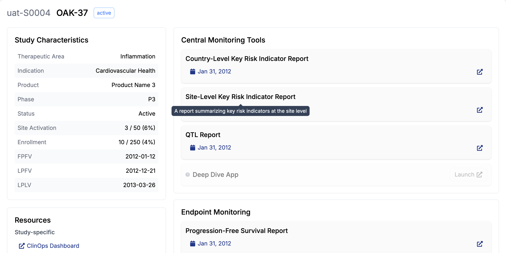
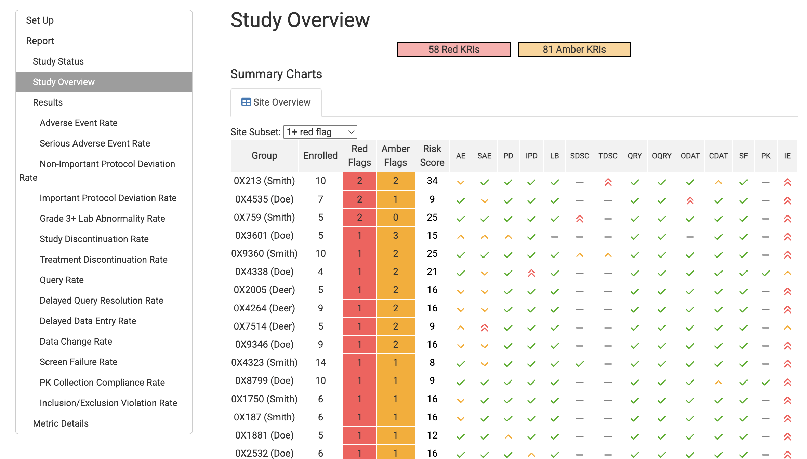
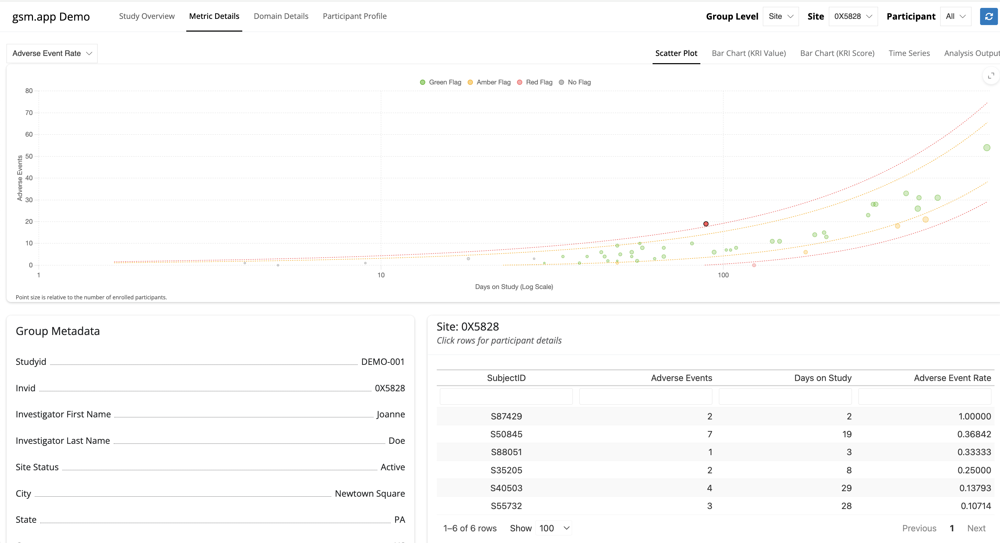
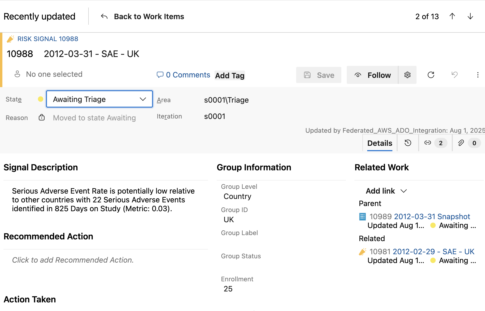
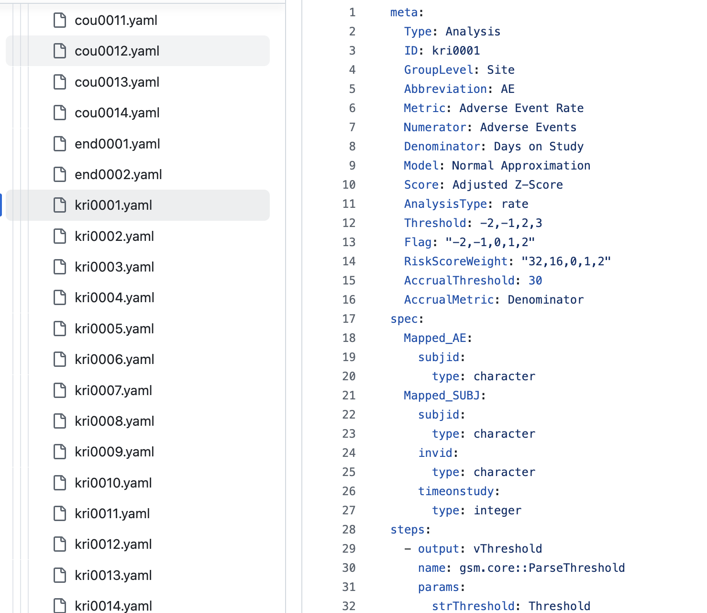
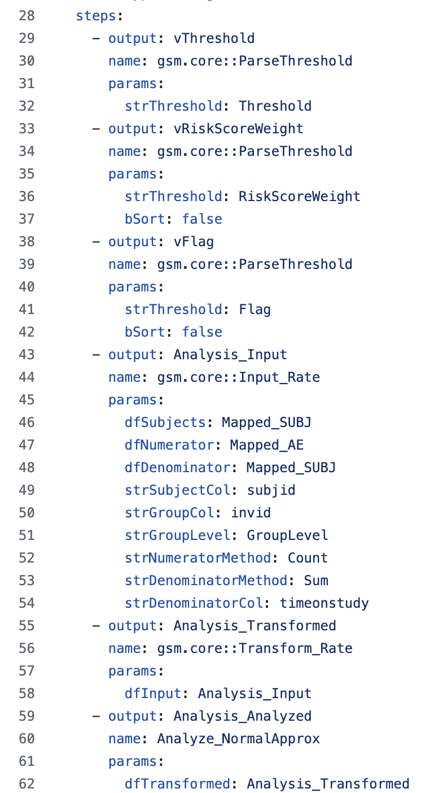
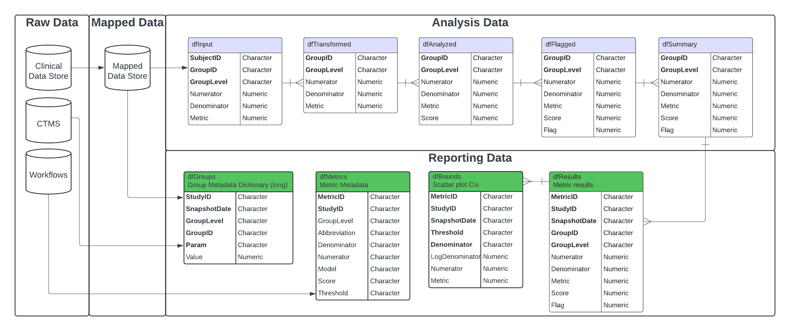
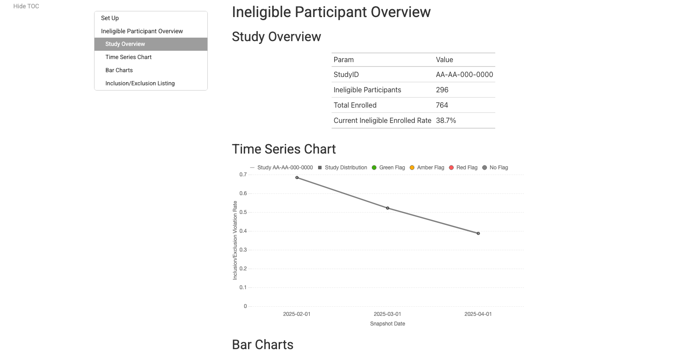

# Contents

::: {.tocbox}
1. <toc>Overview</toc>
2. <toc>Business Process</toc>
3. <toc>Data Model</toc>
4. <toc>Reports and Apps</toc>
:::

# Overview

- `{gsm}` (Good Statistical Monitoring) is a qualified set of R packages that provides a GxP framework for central monitoring in clinical trials.
- Designed to support a variety of business processes, from manually executed RBQM reporting to enterprise-wide monitoring platforms.
- Highly configurable and extensible, with opportunities for AI integration.

# Business Process

::: {.tocbox}
1. <toc>Core {gsm} Business Process</toc>
2. <toc>View Studies in Portfolio</toc>
3. <toc>View Reports for a Study</toc>
4. <toc>View Site Trends in a Report</toc>
5. <toc>View Participant Trends in Deep Dive App</toc>
6. <toc>Manage Risk Signals in Action Log</toc>
:::

## Core {gsm} Business Process

- View Studies in Portfolio
- View Reports for a Study
- View Site Trends in a Report
- View Participant Trends in Deep Dive App
- Manage Risk Signals in Action Log

## <above>Core {gsm} Business Process</above> View Studies in Portfolio {.full-image-slide}

{fig-alt="View studies in portfolio"}

## <above>Core {gsm} Business Process</above> View Reports for a Study {.full-image-slide}

{fig-alt="View reports for a study"}

## <above>Core {gsm} Business Process</above> View Site Trends in a Report {.full-image-slide}

{fig-alt="View site trends in a report"}

## <above>Core {gsm} Business Process</above> View Participant Trends in Deep Dive App {.full-image-slide}

{fig-alt="View participant trends in deep dive app"}

## <above>Core {gsm} Business Process</above> Manage Risk Signals in Action Log {.full-image-slide}

{fig-alt="Manage risk signals in action log"}

# Package Framework and Data Model

::: {.tocbox}
1. <toc>Core {gsm} Packages</toc>
2. <toc>Data Pipeline Overview</toc>
3. <toc>Elevated SAE Rate KRI</toc>
4. <toc>Multiple KRIs</toc>
5. <toc>Configurable Workflows</toc>
6. <toc>Detailed View</toc>
:::

## Core {gsm} Packages

- [`gsm.core`](https://gilead-biostats.github.io/gsm.core/) — Core analytics workflow engine
- [`gsm.mapping`](https://gilead-biostats.github.io/gsm.mapping/) — Study mapping configuration toolkit
- [`gsm.kri`](https://gilead-biostats.github.io/gsm.kri/) — Key risk indicator reporting
- [`gsm.reporting`](https://gilead-biostats.github.io/gsm.reporting/) — Modular report generation framework
- [`gsm.qtl`](https://gilead-biostats.github.io/gsm.qtl/) — Query tolerance limit analytics
- [`gsm.app`](https://gilead-biostats.github.io/gsm.app/) — Interactive monitoring applications layer

## Data Pipeline Overview

::: {.columns}
::: {.column width="58%"}

### {gsm} Data Pipeline

::: {.workflow-grid}
::: {.workflow-card .role-automated}
<strong>⚙️ Data Ingestion</strong> 
Clinical and operational inputs are loaded into the pipeline.
:::

::: {.workflow-card .role-automated}
<strong>⚙️ Data Cleaning</strong> 
Data quality checks and harmonization are applied.
:::

::: {.workflow-card .role-automated}
<strong>⚙️ Metric Calculation</strong> 
Configured metrics and thresholds are computed.
:::

::: {.workflow-card .role-automated}
<strong>⚙️ Reporting / Application Layer</strong> 
Outputs are delivered through reports and applications.
:::

::: {.workflow-card .role-automated}
<strong>⚙️ Risk Signal Business Logic</strong> 
Rules generate and manage risk signals.
:::

::: {.workflow-card .role-human}
<strong>👩‍⚕️ Action Log Framework</strong> 
SME review and action assignment with traceability.
:::
:::
:::

::: {.column width="42%" font-size="0.4em"}

::: {.callout-note .small appearance="simple"}

### Key Features

- Modular, configurable, and extensible framework
- Scheduled snapshots
- All layers are configurable by study and domain
- Supports custom business logic (for example, auto-triage)
- Platform agnostic with AI-in-the-loop opportunities
:::

:::
:::

## <above>{gsm} Data Pipeline Example</above> Elevated SAE Rate KRI

::: {.workflow-grid}
::: {.workflow-card .role-automated}
<strong>⚙️ Ingestion</strong> 
Clinical data lake (AE and participant domains) + operational data lake (site/study metadata).
:::

::: {.workflow-card .role-automated}
<strong>⚙️ Data Cleaning</strong> 
Check anomalies, standardize participant populations between domains, and filter to serious SAEs.
:::

::: {.workflow-card .role-automated}
<strong>⚙️ Metric Calculation</strong> 
Numerator = number of SAEs; denominator = months on study; metric = site-level SAE rate; score = Z-score; flag = red/amber/green.
:::

::: {.workflow-card .role-automated}
<strong>⚙️ Report</strong> 
{gsm} KRI report
:::

::: {.workflow-card .role-automated}
<strong>⚙️ Risk Signal Business Logic</strong> 
Create site-level risk signals for red/amber flags, suppress repeat signals, and provide default actions.
:::

::: {.workflow-card .role-human}
<strong>👩‍⚕️ Action Log</strong> 
SME reviews each risk signal and assigns actions in ADO.
:::
:::

## <above>{gsm} Data Pipeline Example</above> Multiple KRIs

::: {.workflow-grid .workflow-multi-kri}
::: {.workflow-row}
::: {.workflow-card .role-automated}
<strong>⚙️ Ingestion</strong>
:::
:::

::: {.workflow-row .ten-up}
::: {.workflow-card .role-automated}
<strong>⚙️ AE Data Cleaning</strong>
:::
::: {.workflow-card .role-automated}
<strong>⚙️ Protocol Dev.</strong>
:::
::: {.workflow-card .role-automated}
<strong>⚙️ Enrollment</strong>
:::
::: {.workflow-card .role-automated}
<strong>⚙️ Queries</strong>
:::
::: {.workflow-card .role-automated}
<strong>⚙️ Labs</strong>
:::
:::

::: {.workflow-row .ten-up}
::: {.workflow-card .role-automated}
<strong>⚙️ AE Rate</strong>
:::
::: {.workflow-card .role-automated}
<strong>⚙️ SAE Rate</strong>
:::
::: {.workflow-card .role-automated}
<strong>⚙️ PD Rate</strong>
:::
::: {.workflow-card .role-automated}
<strong>⚙️ IPD Rate</strong>
:::
::: {.workflow-card .role-automated}
<strong>⚙️ Drop Out Rate</strong>
:::
::: {.workflow-card .role-automated}
<strong>⚙️ Disc. Rate</strong>
:::
::: {.workflow-card .role-automated}
<strong>⚙️ Query Rate</strong>
:::
::: {.workflow-card .role-automated}
<strong>⚙️ Time To Query</strong>
:::
::: {.workflow-card .role-automated}
<strong>⚙️ Lab Compliance</strong>
:::
::: {.workflow-card .role-automated}
<strong>⚙️ Grade 4+ Rate</strong>
:::
:::

::: {.workflow-row}
::: {.workflow-card .role-automated}
<strong>⚙️ Report</strong>
:::
:::

::: {.workflow-row}
::: {.workflow-card .role-automated}
<strong>⚙️ Risk Signals</strong>
:::
:::

::: {.workflow-row}
::: {.workflow-card .role-human}
<strong>👩‍⚕️ Action Log</strong>
:::
:::
:::

## <above>{gsm} Data Pipeline</above> Configurable Workflows {.constrain-images}

::: {.columns}
::: {.column width="65%"}
{fig-alt="Workflow yaml configuration example 1"}
:::

::: {.column width="35%"}
{fig-alt="Workflow yaml configuration example 2"}
:::
:::

## <above>{gsm} Data Model</above> Detailed View {.full-image-slide}

{fig-alt="Detailed {gsm} data model"}

<a href="https://gilead-biostats.github.io/gsm.core/articles/DataModel.html">Data model vignette</a>

# Reports and Apps

::: {.tocbox}
1. <toc>Sample Report Links</toc>
2. <toc>Cross-Study KRI Report</toc>
3. <toc>Country KRI Report</toc>
4. <toc>Eligibility Report</toc>
5. <toc>Site KRI Report</toc>
6. <toc>QTL Report</toc>
7. <toc>{gsm} Deep Dive App</toc>
:::

## Sample Report Links
- [Site KRI Report](https://gilead-biostats.github.io/gsm.kri/examples/Example_SiteReport.html)
- [Country KRI Report](https://gilead-biostats.github.io/gsm.kri/examples/Example_CountryReport.html)
- [Cross-Study KRI Report](https://gilead-biostats.github.io/gsm.kri/examples/Example_CrossStudySRS.html)
- [Eligibility Report](https://gilead-biostats.github.io/gsm.kri/examples/Example_Eligibility.html)
- [QTL Report](https://gilead-biostats.github.io/gsm.qtl/examples/Example_QTL.html)
- [{gsm} Deep Dive App](https://rinpharma.shinyapps.io/gsm-app/)

## Cross-Study KRI Report {.full-image-slide}

{fig-alt="Cross-Study KRI Report screenshot"}

<a href="https://gilead-biostats.github.io/gsm.kri/examples/Example_CrossStudySRS.html">Open report</a>

## Country KRI Report {.full-image-slide}

{fig-alt="Country KRI Report screenshot"}

<a href="https://gilead-biostats.github.io/gsm.kri/examples/Example_CountryReport.html">Open report</a>

## Eligibility Report {.full-image-slide}

{fig-alt="Eligibility Report screenshot"}

<a href="https://gilead-biostats.github.io/gsm.kri/examples/Example_Eligibility.html">Open report</a>

## Site KRI Report {.full-image-slide}

{fig-alt="Site KRI Report screenshot"}

<a href="https://gilead-biostats.github.io/gsm.kri/examples/Example_SiteReport.html">Open report</a>

## QTL Report {.full-image-slide}

{fig-alt="QTL Report screenshot"}

<a href="https://gilead-biostats.github.io/gsm.qtl/examples/Example_QTL.html">Open report</a>

## {gsm} Deep Dive App {.full-image-slide}

{fig-alt="{gsm} Deep Dive App screenshot"}

<a href="https://rinpharma.shinyapps.io/gsm-app/">Open app</a>

