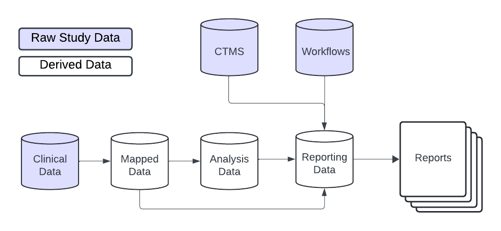
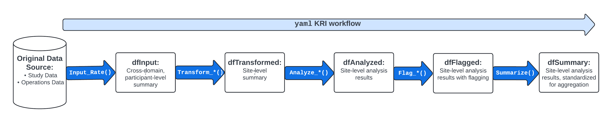
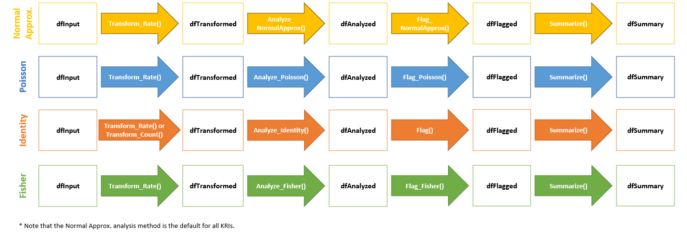
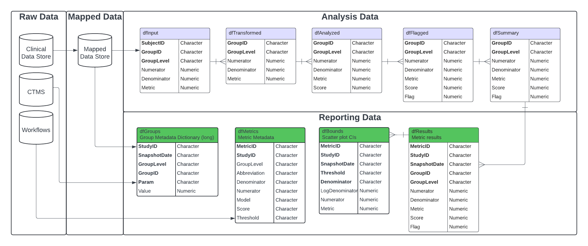

# Data Model

## Introduction

The `{gsm}` suite of packages provides a standardized data pipeline for
conducting study-level Risk Based Quality Management (RBQM) for clinical
trials. There are four main types of data used in the `{gsm}` suite of
packages:

- **Raw Data** - Clinical and operational data from study databases
- **Mapped Data** - Data that has been transformed and standardized for
  analysis
- **Analysis Data** - Data that has been analyzed to calculate Key Risk
  Indicators (KRIs)
- **Reporting Data** - Data that has been summarized and formatted for
  reporting

This vignette provides a high-level overview of how each type of data is
used, and includes detailed data specifications as appendices.

## Data Model Overview

In general, the `{gsm}` suite of packages is designed to be flexible and
customizable, allowing users to build custom data pipelines that support
many types of raw study data. As shown below, raw clinical data is
transformed into mapped data, which is then analyzed to calculate
desired metrics. The analysis data is then combined and formatted for
reporting with additional data, including CTMS data (mapped via
`{gsm.mapping}`) and metric workflow metadata (from the `{gsm.kri}`
metric workflow YAML files), which provides relevant metadata for
reports.



## Raw and Mapped Data

The `{gsm}` suite of packages is designed to work with a wide variety of
clinical data sources. The raw data used in the analysis pipeline is
typically sourced from clinical trial databases and is transformed into
mapped data using simple transformations. Mapped data is then used as
input for the analysis pipeline.

There is not a single data standard for raw or mapped data in
`{gsm.mapping}`. The only requirement is that the mapped data is
compatible with the analytics pipeline. Data Mapping transformations can
be done using multiple methods including custom R scripts (e.g., with
`dplyr`), SQL queries, or using `gsm.mapping` workflows (e.g. the
`system.file("workflow/1_mappings/AE.yaml", package = "gsm.mapping")`
file). Examples of these methods can be found in the [Adverse Event
Workflow
Cookbook](https://gilead-public.github.io/gsm.kri/examples/Cookbook_AdverseEventWorkflow.html).

## Analysis Data

In `{gsm.kri}` analysis data is used to capture key metrics associated
with the conduct of a clinical trial. A set of standard Key Risk
Indicator (KRI) metrics is included in `{gsm.kri}` along with automated
workflows that allow them to be run for all sites or countries in a
study. Examples of KRIs include the rate of adverse events or amount of
missing data at a site or across sites. Defining and deploying KRIs
during study conduct allows study teams to continually monitor risks to
the integrity of the trial and take corrective actions accordingly.



The image above provides an overview of the default KRI analysis
pipeline. The pipeline is a standardized five-step process for assessing
data issues by going from participant-level input data to a standardized
site-level summary of model results. The functions used in each step of
the data pipeline along with the input and output datasets are described
in more detail below.

1.  `dfInput`: Input data; Cross-domain participant-level input data
    with all needed data for KRI derivation. Created by the
    [`Input_Rate()`](https://gilead-public.github.io/gsm.core/dev/reference/Input_Rate.md)
    function using `mapped` data as input.
2.  `dfTransformed`: Transformed data; Site-level transformed data
    including KRI calculation. Created by `Transform_*()` functions
    using `dfInput` as input.
3.  `dfAnalyzed`: Analyzed data; Site-level analysis results data.
    Created by `Analyze_*()` functions using `dfTransformed` as input.
4.  `dfFlagged`: Flagged data; Site-level analysis results with flags
    added to indicate potential statistical outliers. Created by passing
    numeric thresholds to the
    [`Flag()`](https://gilead-public.github.io/gsm.core/dev/reference/Flag.md)
    function (or its aliases
    [`Flag_NormalApprox()`](https://gilead-public.github.io/gsm.core/dev/reference/Flag_NormalApprox.md)
    and
    [`Flag_Poisson()`](https://gilead-public.github.io/gsm.core/dev/reference/Flag_Poisson.md))
    using `dfAnalyzed` as input.
5.  `dfSummary`: Summary data; Standardized subset of the flagged data.
    This summary data has the same structure for all assessments and
    always includes both KRI and Flag values so that a user can easily
    look at trends for any given site across multiple assessments.
    Created using the
    [`Summarize()`](https://gilead-public.github.io/gsm.core/dev/reference/Summarize.md)
    function using `dfFlagged` as input.

The data requirements for each component of the analysis pipeline are
rigid; See [Appendix 1](#appendix-1---data-model) for full
specifications.

### Analysis Workflows

Since there are rigid data requirements for each component of the
analysis data model, the analysis workflow is largely standardized.
There are two main approaches to running the analysis workflow:

1.  **Scripted Analysis**: Run each step of the analysis pipeline
    individually using the functions provided in the `{gsm}` suite of
    packages. This approach is useful for understanding the data
    requirements and for debugging. See the [Adverse Event KRI
    Cookbook](https://gilead-public.github.io/gsm.kri/examples/Cookbook_AdverseEventKRI.html)
    for an example of this approach.
2.  **Workflow Analysis**: Run the analysis pipeline using a YAML
    workflow file. This approach is useful for running the same analysis
    on multiple studies or for automating the analysis process. See the
    [Adverse Event Workflow
    Cookbook](https://gilead-public.github.io/gsm.kri/examples/Cookbook_AdverseEventWorkflow.html)
    for an example of this approach.

Note that each step in these workflows can be customized based on the
requirements for a specific KRI. The graphic below shows four such
workflows. Note that
[`Flag()`](https://gilead-public.github.io/gsm.core/dev/reference/Flag.md)
is the flagging function for every model
([`Flag_NormalApprox()`](https://gilead-public.github.io/gsm.core/dev/reference/Flag_NormalApprox.md)
and
[`Flag_Poisson()`](https://gilead-public.github.io/gsm.core/dev/reference/Flag_Poisson.md)
are aliases of
[`Flag()`](https://gilead-public.github.io/gsm.core/dev/reference/Flag.md);
there is no `Flag_Fisher()`). Because
[`Analyze_Fisher()`](https://gilead-public.github.io/gsm.core/dev/reference/Analyze_Fisher.md)
returns two-sided p-values as `Score`, Fisher workflows need p-value
thresholds,
e.g. `Flag(dfAnalyzed, vThreshold = c(0.01, 0.05), vFlag = c(2, 1, 0), vFlagOrder = c(2, 1, 0))`;
the p-value carries no direction, so compare `Prop` with `Prop_Other` to
see whether a group is high or low. Also note that
[`Summarize()`](https://gilead-public.github.io/gsm.core/dev/reference/Summarize.md)
requires `GroupID`, `GroupLevel`, `Flag` and `Score` columns; the output
of
[`Analyze_Fisher()`](https://gilead-public.github.io/gsm.core/dev/reference/Analyze_Fisher.md)
(and of
[`Transform_Count()`](https://gilead-public.github.io/gsm.core/dev/reference/Transform_Count.md))
has no `GroupLevel` column, so one must be added (e.g. with
`dplyr::mutate(GroupLevel = "Site")`) before calling
[`Summarize()`](https://gilead-public.github.io/gsm.core/dev/reference/Summarize.md).



More details about analysis data pipelines can be found in the [Data
Analysis
article](https://gilead-public.github.io/gsm.core/articles/DataAnalysis.html).

## Reporting Data

A rigid Reporting Data framework is provided in `{gsm.reporting}` to
allow for standardized reporting, visualization and meta-analysis that
compare risk profiles across timepoints, and even across multiple
studies. The Reporting Data sets used in `{gsm.reporting}` and
`{gsm.kri}` are:

1.  `Reporting_Results`: Summary data; Standardized subset of the
    flagged data. This summary data has the same structure for all
    assessments and always includes both KRI and Flag values so that a
    user can easily look at trends for any given site across multiple
    assessments. Created using the
    [`Summarize()`](https://gilead-public.github.io/gsm.core/dev/reference/Summarize.md)
    function in the analytics pipeline, followed by the `BindResults()`
    function to add columns necessary for reporting and stack metrics
    into a single data.frame, and the `CalculateChange()` function to
    add changes from the previous snapshot.
2.  `Reporting_Bounds`: Bounded data; A data.frame containing predicted
    boundary values with upper and lower bounds across the range of
    observed values. Created with the `MakeBounds()` function.
3.  `Reporting_Groups`: Grouped data; Long data.frame of summarized
    group CTMS data with site, study, and country level counts and
    metrics. Constructed by binding the mapped group data
    (`Mapped_STUDY`, `Mapped_SITE`, `Mapped_COUNTRY`) created with
    `gsm.mapping::MakeLongMeta()`.
4.  `Reporting_Metrics`: Metric metadata; Metric-specific metadata for
    use in charts and reporting. Created by passing a list of metric
    workflows (`lWorkflows`) to the `MakeMetric()` function.

Similar to Analysis Workflows, reporting data pipelines can be run as R
scripts or as YAML workflows. The [Reporting Workflow
Cookbook](https://gilead-public.github.io/gsm.kri/examples/Cookbook_ReportingWorkflow.html)
shows how to populate the Reporting Data tables using output from the
Analysis Workflows and other study data sources. The [Step-by-Step
Reporting
Workflow](https://gilead-public.github.io/gsm.reporting/articles/DataReporting.html)
article in `{gsm.reporting}` provides more details on the Reporting Data
model.

## Appendix 1 - Data Model

## Overview



## Analytics data model

The KRI analytics pipeline is a standardized process for **Analyzing**
data issues by going from participant-level `input` data to a
standardized site-level `summary` of model results. The data sets used
in each step of the data pipeline are described in detail below. When
using a metric workflow YAML to create these tables, all data tables are
contained in a list, which we call `lAnalysis`. This list is then fed
into the reporting data pipeline.

### Analysis Data Tables

#### `Analysis_Input`

- Function(s) used to create table:
  - [`gsm.core::Input_Rate()`](https://gilead-public.github.io/gsm.core/dev/reference/Input_Rate.md)
- Inputs:
  - `dfSubjects` (e.g. `Mapped_SUBJ`)
  - `dfNumerator` (e.g. `Mapped_AE`)
  - `dfDenominator` (e.g. `Mapped_SUBJ`)
- Usage: The base data.frame for all Analysis workflows. Feeds into the
  `Transform_*()` functions. One row per subject; subjects without
  numerator/denominator records get a value of 0, and rows with a
  missing `GroupID` are removed.
- Structure:

| Table | Column Name | Description | Type | Optional |
|----|----|----|----|----|
| Analysis_Input | SubjectID | The subject ID | Character |  |
| Analysis_Input | GroupID | The group ID for the metric | Character |  |
| Analysis_Input | GroupLevel | The group type for the metric (e.g. “Site”) | Character |  |
| Analysis_Input | Numerator | The calculated numerator value | Numeric |  |
| Analysis_Input | Denominator | The calculated denominator value | Numeric |  |
| Analysis_Input | Metric | The calculated subject-level rate/metric value (`Numerator / Denominator`) | Numeric |  |

#### `Analysis_Transformed`

- Function(s) used to create table:
  - [`gsm.core::Transform_Rate()`](https://gilead-public.github.io/gsm.core/dev/reference/Transform_Rate.md)
  - [`gsm.core::Transform_Count()`](https://gilead-public.github.io/gsm.core/dev/reference/Transform_Count.md)
- Inputs: `Analysis_Input`
- Usage: Convert from input data format to needed format to derive KRI
  for an Assessment via the `Analyze_*()` functions.
- Structure
  ([`Transform_Rate()`](https://gilead-public.github.io/gsm.core/dev/reference/Transform_Rate.md);
  groups with a `Denominator` of 0 are removed):

| Table | Column Name | Description | Type | Optional |
|----|----|----|----|----|
| Analysis_Transformed | GroupID | The group ID for the metric | Character |  |
| Analysis_Transformed | GroupLevel | The group type for the metric (e.g. “Site”) | Character |  |
| Analysis_Transformed | Numerator | The calculated numerator value | Numeric |  |
| Analysis_Transformed | Denominator | The calculated denominator value | Numeric |  |
| Analysis_Transformed | Metric | The calculated rate/metric value (`Numerator / Denominator`) | Numeric |  |

- Structure
  ([`Transform_Count()`](https://gilead-public.github.io/gsm.core/dev/reference/Transform_Count.md)):

| Table | Column Name | Description | Type | Optional |
|----|----|----|----|----|
| Analysis_Transformed | GroupID | The group ID for the metric | Character |  |
| Analysis_Transformed | TotalCount | The sum of `strCountCol` for the group | Numeric |  |
| Analysis_Transformed | Metric | The metric value (equal to `TotalCount`) | Numeric |  |

#### `Analysis_Analyzed`

- Function(s) used to create table:
  - [`gsm.core::Analyze_Fisher()`](https://gilead-public.github.io/gsm.core/dev/reference/Analyze_Fisher.md)
  - [`gsm.core::Analyze_Identity()`](https://gilead-public.github.io/gsm.core/dev/reference/Analyze_Identity.md)
  - [`gsm.core::Analyze_NormalApprox()`](https://gilead-public.github.io/gsm.core/dev/reference/Analyze_NormalApprox.md)
  - [`gsm.core::Analyze_Poisson()`](https://gilead-public.github.io/gsm.core/dev/reference/Analyze_Poisson.md)
- Inputs: `Analysis_Transformed`
- Usage: Prepare the data for
  [`Flag()`](https://gilead-public.github.io/gsm.core/dev/reference/Flag.md)
  by performing the specified test on the metric provided.
- Structure (columns marked `*` are only returned by some `Analyze_*()`
  functions;
  [`Analyze_Identity()`](https://gilead-public.github.io/gsm.core/dev/reference/Analyze_Identity.md)
  returns the columns of its input plus `Score`, and
  [`Analyze_Fisher()`](https://gilead-public.github.io/gsm.core/dev/reference/Analyze_Fisher.md)
  returns no `GroupLevel` column):

| Table | Column Name | Description | Type | Optional |
|----|----|----|----|----|
| Analysis_Analyzed | GroupID | The group ID for the metric | Character |  |
| Analysis_Analyzed | GroupLevel | The group type for the metric (e.g. “Site”) | Character |  |
| Analysis_Analyzed | Numerator | The calculated numerator value | Numeric |  |
| Analysis_Analyzed | Denominator | The calculated denominator value | Numeric |  |
| Analysis_Analyzed | Metric | The calculated rate/metric value | Numeric |  |
| Analysis_Analyzed | Score | The Statistical Score (e.g. adjusted z-score, deviance residual, p-value or metric value) | Numeric |  |
| Analysis_Analyzed | OverallMetric | The overall rate/proportion across all groups ([`Analyze_NormalApprox()`](https://gilead-public.github.io/gsm.core/dev/reference/Analyze_NormalApprox.md)) | Numeric | \* |
| Analysis_Analyzed | Factor | The over-dispersion factor ([`Analyze_NormalApprox()`](https://gilead-public.github.io/gsm.core/dev/reference/Analyze_NormalApprox.md)) | Numeric | \* |
| Analysis_Analyzed | PredictedCount | The expected count from the Poisson model ([`Analyze_Poisson()`](https://gilead-public.github.io/gsm.core/dev/reference/Analyze_Poisson.md)) | Numeric | \* |
| Analysis_Analyzed | Numerator_Other, Denominator_Other, Prop, Prop_Other, Estimate | Values for all other groups, group proportions and odds ratio estimate ([`Analyze_Fisher()`](https://gilead-public.github.io/gsm.core/dev/reference/Analyze_Fisher.md)) | Numeric | \* |

#### `Analysis_Flagged`

- Function(s) used to create table:
  - [`gsm.core::Flag()`](https://gilead-public.github.io/gsm.core/dev/reference/Flag.md)
- Inputs: `Analysis_Analyzed`
- Usage: Flag a group-level metric to be summarized via
  [`gsm.core::Summarize()`](https://gilead-public.github.io/gsm.core/dev/reference/Summarize.md)
  and used for reporting.
- Structure:

| Table | Column Name | Description | Type | Optional |
|----|----|----|----|----|
| Analysis_Flagged | GroupID | The group ID for the metric | Character |  |
| Analysis_Flagged | GroupLevel | The group type for the metric (e.g. “Site”) | Character |  |
| Analysis_Flagged | Numerator | The calculated numerator value | Numeric |  |
| Analysis_Flagged | Denominator | The calculated denominator value | Numeric |  |
| Analysis_Flagged | Metric | The calculated rate/metric value | Numeric |  |
| Analysis_Flagged | Score | The Statistical Score | Numeric |  |
| Analysis_Flagged | Flag | The ordinal Flag to be applied | Numeric |  |
| Analysis_Flagged | OverallMetric | The overall rate/proportion across all groups ([`Analyze_NormalApprox()`](https://gilead-public.github.io/gsm.core/dev/reference/Analyze_NormalApprox.md)) | Numeric | \* |
| Analysis_Flagged | Factor | The over-dispersion factor ([`Analyze_NormalApprox()`](https://gilead-public.github.io/gsm.core/dev/reference/Analyze_NormalApprox.md)) | Numeric | \* |
| Analysis_Flagged | PredictedCount | The expected count from the Poisson model ([`Analyze_Poisson()`](https://gilead-public.github.io/gsm.core/dev/reference/Analyze_Poisson.md)) | Numeric | \* |
| Analysis_Flagged | Numerator_Other, Denominator_Other, Prop, Prop_Other, Estimate | Values for all other groups, group proportions and odds ratio estimate ([`Analyze_Fisher()`](https://gilead-public.github.io/gsm.core/dev/reference/Analyze_Fisher.md)) | Numeric | \* |
| Analysis_Flagged | Weight, WeightMax | Risk score weight for the flag and maximum weight (only when `vRiskScoreWeight` is provided) | Numeric | \* |

#### `Analysis_Summary`

- Function(s) used to create table:
  - [`gsm.core::Summarize()`](https://gilead-public.github.io/gsm.core/dev/reference/Summarize.md)
- Inputs: `Analysis_Flagged`
- Usage: Summarize KRI at the group level for reporting. Rows are sorted
  by `Flag` in the order 2, -2, 1, -1, 0 and then by descending absolute
  `Metric`.
- Structure:

| Table | Column Name | Description | Type | Optional |
|----|----|----|----|----|
| Analysis_Summary | GroupID | The group ID for the metric | Character |  |
| Analysis_Summary | GroupLevel | The group type for the metric (e.g. “Site”) | Character |  |
| Analysis_Summary | Numerator | The calculated numerator value | Numeric |  |
| Analysis_Summary | Denominator | The calculated denominator value | Numeric |  |
| Analysis_Summary | Metric | The calculated rate/metric value | Numeric |  |
| Analysis_Summary | Score | The Statistical Score | Numeric |  |
| Analysis_Summary | Flag | The ordinal Flag to be applied | Numeric |  |

## Overview of Reporting data model

### Reporting Data Tables

#### `Reporting_Results`

- Function(s) used to create table:
  - `gsm.reporting::BindResults()`
  - `gsm.reporting::CalculateChange()`
  - `gsm.kri::FilterByLatestSnapshotDate()`
- Inputs: `lAnalyzed` (named list of `lAnalysis` outputs), `strStudyID`,
  `dSnapshotDate`, `Reporting_Results_Longitudinal` (results from
  previous snapshots)
- Workflow used to create table: `3_reporting/Results.yaml` in
  `{gsm.reporting}`
- Usage: Summarize KRI at the group level for reporting.
- Structure:

| Table | Column Name | Description | Type | Optional |  |
|----|----|----|----|----|----|
| Reporting_Results | GroupID | The group ID for the metric | Character |  |  |
| Reporting_Results | GroupLevel | The group type for the metric (e.g. “Site”) | Character |  |  |
| Reporting_Results | Numerator | The calculated numerator value | Numeric |  |  |
| Reporting_Results | Denominator | The calculated denominator value | Numeric |  |  |
| Reporting_Results | Metric | The calculated rate/metric value | Numeric |  |  |
| Reporting_Results | Score | The calculated metric score | Numeric |  |  |
| Reporting_Results | Flag | The calculated flag | Numeric |  |  |
| Reporting_Results | MetricID | The Metric ID | Character |  |  |
| Reporting_Results | StudyID | The Study ID (only added when `strStudyID` is provided) | Character | \* |  |
| Reporting_Results | SnapshotDate | The Date of the snapshot | Date |  |  |
| Reporting_Results | SnapshotDate_Previous | The Date of the previous snapshot (added by `CalculateChange()`) | Date | \* |  |
| Reporting_Results | `<Param>`\_Previous, `<Param>`\_Change, `<Param>`\_PercentChange | Previous value, change and percent change from the previous snapshot for `Numerator`, `Denominator`, `Metric`, `Score` and `Flag` (added by `CalculateChange()`) | Numeric | \* |  |

#### `Reporting_Bounds`

- Function(s) used to create table:
  - `gsm.reporting::MakeBounds()`
  - [`gsm.core::Analyze_NormalApprox_PredictBounds()`](https://gilead-public.github.io/gsm.core/dev/reference/Analyze_NormalApprox_PredictBounds.md)
    or
    [`gsm.core::Analyze_Poisson_PredictBounds()`](https://gilead-public.github.io/gsm.core/dev/reference/Analyze_Poisson_PredictBounds.md)
    (called within `gsm.reporting::MakeBounds()`, based on the metric’s
    `AnalysisType`; no bounds are created for `identity` metrics)
- Inputs: `Reporting_Results`, `Reporting_Metrics`
- Workflow used to create table: `3_reporting/Bounds.yaml` in
  `{gsm.reporting}`
- Usage: Calculates predicted percentages/rates and upper- and
  lower-bounds across the full range of sample sizes/total exposure
  values for reporting.
- Structure:

| Table | Column Name | Description | Type | Optional |  |
|----|----|----|----|----|----|
| Reporting_Bounds | Threshold | The number of standard deviations that the upper and lower bounds are based on (0 gives the expected value) | Numeric |  |  |
| Reporting_Bounds | Denominator | The calculated denominator value | Numeric |  |  |
| Reporting_Bounds | LogDenominator | The calculated log denominator value | Numeric |  |  |
| Reporting_Bounds | Numerator | The calculated numerator value | Numeric |  |  |
| Reporting_Bounds | Metric | The calculated rate/metric value | Numeric |  |  |
| Reporting_Bounds | MetricID | The Metric ID | Character |  |  |
| Reporting_Bounds | StudyID | The Study ID | Character |  |  |
| Reporting_Bounds | SnapshotDate | The Date of the snapshot | Date |  |  |

#### `Reporting_Groups`

- Function(s) used to create table:
  - `gsm.mapping::MakeLongMeta()` (called in the `{gsm.mapping}`
    `STUDY`, `SITE` and `COUNTRY` mapping workflows)
  - [`dplyr::bind_rows()`](https://dplyr.tidyverse.org/reference/bind_rows.html)
- Inputs: `Mapped_STUDY`, `Mapped_SITE`, `Mapped_COUNTRY` (mapped CTMS
  study and site data and participant counts)
- Workflow used to create table: `3_reporting/Groups.yaml` in
  `{gsm.reporting}`
- Usage: Group-level metadata dictionary.
- Structure: Long data frame, with certain `Param` required for given
  `GroupLevel`

| Table | Column | Description | Type | Optional |
|----|----|----|----|----|
| Reporting_Groups | GroupID | Unique Group ID | Character |  |
| Reporting_Groups | GroupLevel | Group Level (e.g. Site, Country) | Character |  |
| Reporting_Groups | Param | Parameter Name (e.g. “Status”) | Character |  |
| Reporting_Groups | Value | Parameter Value (e.g. “Active”) | Character |  |

Expected `Param` by `GroupLevel` for use in gsm reporting. User may add
other Param values as needed.

| GroupLevel | Param                 | Description                 | Value Type |
|------------|-----------------------|-----------------------------|------------|
| Study      | status                | Study Status                | Character  |
| Study      | ParticipantCount      | \# of Enrolled Participants | Numeric    |
| Study      | SiteCount             | \# of Activated Sites       | Numeric    |
| Site       | ParticipantCount      | \# of Enrolled Participants | Numeric    |
| Site       | site_status           | Site Status                 | Character  |
| Site       | InvestigatorFirstName | Investigator First name     | Character  |
| Site       | InvestigatorLastName  | Investigator Last name      | Character  |
| Site       | City                  | City                        | Character  |
| Site       | State                 | State                       | Character  |
| Site       | Country               | Country                     | Character  |
| Country    | ParticipantCount      | \# of Enrolled Participants | Numeric    |
| Country    | SiteCount             | \# of Sites                 | Numeric    |

#### `Reporting_Metrics`

- Function used to create table: `gsm.reporting::MakeMetric()`
- Inputs: `lWorkflows` - list of metric workflows for the corresponding
  kri(s), e.g. made with
  [`workr::MakeWorkflowList()`](https://rdrr.io/pkg/workr/man/MakeWorkflowList.html).
  Each `meta` field becomes a column.
- Workflow used to create table: `3_reporting/Metrics.yaml` in
  `{gsm.reporting}`
- Usage: Metadata used for charts and tables
- Structure:

| Table | Column Name | Description | Type | Optional |  |
|----|----|----|----|----|----|
| Reporting_Metrics | MetricID | ID for the Metric (`<Type>_<ID>`, e.g. “Analysis_kri0001”) | Character |  |  |
| Reporting_Metrics | Type | Workflow type (e.g. “Analysis”) | Character |  |  |
| Reporting_Metrics | ID | Workflow ID (e.g. “kri0001”) | Character |  |  |
| Reporting_Metrics | GroupLevel | The group type for the metric (e.g. “Site”) | Character |  |  |
| Reporting_Metrics | Abbreviation | Abbreviation for the metric | Character |  |  |
| Reporting_Metrics | Metric | Name of the metric | Character |  |  |
| Reporting_Metrics | Numerator | Data source for the Numerator | Character |  |  |
| Reporting_Metrics | Denominator | Data source for the Denominator | Character |  |  |
| Reporting_Metrics | Model | Model used to calculate metric | Character |  |  |
| Reporting_Metrics | Score | Type of Score reported | Character |  |  |
| Reporting_Metrics | AnalysisType | Analysis type (e.g. “rate”, “binary”, “identity”), used by `MakeBounds()` | Character | \* |  |
| Reporting_Metrics | Threshold | Comma-separated thresholds, used for flags and bounds | Character | \* |  |
| Reporting_Metrics | Flag, RiskScoreWeight, AccrualThreshold, AccrualMetric, … | Any other `meta` fields of the workflow | Mixed | \* |  |

### Appendix 2 - Analysis Workflow Specifications

Assessment workflow metadata objects are passed to the `lWorkflow`
parameter in
[`workr::RunWorkflow()`](https://rdrr.io/pkg/workr/man/RunWorkflow.html)
to define functions and parameters across multiple studies.

The `lWorkflow` object is a named list of metadata, data specifications
and steps defining how each assessment should be run. The default metric
workflows can be imported from `workflow/2_metrics` in `{gsm.kri}` with
`workr::MakeWorkflowList(strPath = "workflow/2_metrics", strPackage = "gsm.kri")`.
Each workflow contains the following sections:

- `meta`: specifies all of the metadata information for the KRI.
- `spec`: specifies the required input data sets and columns.
- `steps`: specifies all of the steps in the workflow, which are run in
  order.
  - `steps[]$name`: name of the function to call (optionally namespaced,
    e.g. [`gsm.core::Flag`](https://gilead-public.github.io/gsm.core/dev/reference/Flag.md)).
  - `steps[]$output`: specifies the name of the output data from the
    workflow step, which can be used as an input in the next step in the
    workflow
  - `steps[]$params`: specifies parameters to be passed to the function.
    Parameter values that match a `meta` field or the name of an
    available data set (including outputs of previous steps) are
    replaced by that value.

For example, the default workflow for the AE assessment
(`system.file("workflow/2_metrics/kri0001.yaml", package = "gsm.kri")`)
is shown below:

``` yaml
meta:
  Active: true
  Type: Analysis
  ID: kri0001
  GroupLevel: Site
  Abbreviation: AE
  Metric: Adverse Event Rate
  Numerator: Adverse Events
  Denominator: Days on Study
  Model: Normal Approximation
  Score: Adjusted Z-Score
  AnalysisType: rate
  Threshold: -2,-1,2,3
  Flag: "-2,-1,0,1,2"
  RiskScoreWeight: "32,16,0,1,2"
  AccrualThreshold: 30
  AccrualMetric: Denominator
  GenerateRiskSignal: true
spec:
  Mapped_AE:
    subjid:
      type: character
  Mapped_SUBJ:
    subjid:
      type: character
    invid:
      type: character
    timeonstudy:
      type: integer
steps:
  - output: vThreshold
    name: gsm.core::ParseThreshold
    params:
      strThreshold: Threshold
  - output: vRiskScoreWeight
    name: gsm.core::ParseThreshold
    params:
      strThreshold: RiskScoreWeight
      bSort: false
  - output: vFlag
    name: gsm.core::ParseThreshold
    params:
      strThreshold: Flag
      bSort: false
  - output: Analysis_Input
    name: gsm.core::Input_Rate
    params:
      dfSubjects: Mapped_SUBJ
      dfNumerator: Mapped_AE
      dfDenominator: Mapped_SUBJ
      strSubjectCol: subjid
      strGroupCol: invid
      strGroupLevel: GroupLevel
      strNumeratorMethod: Count
      strDenominatorMethod: Sum
      strDenominatorCol: timeonstudy
  - output: Analysis_Transformed
    name: gsm.core::Transform_Rate
    params:
      dfInput: Analysis_Input
  - output: Analysis_Analyzed
    name: Analyze_NormalApprox
    params:
      dfTransformed: Analysis_Transformed
      strType: AnalysisType
  - output: Analysis_Flagged
    name: gsm.core::Flag
    params:
      dfAnalyzed: Analysis_Analyzed
      vThreshold: vThreshold
      vFlag: vFlag
      vRiskScoreWeight: vRiskScoreWeight
      nAccrualThreshold: AccrualThreshold
      strAccrualMetric: AccrualMetric
  - output: Analysis_Summary
    name: gsm.core::Summarize
    params:
      dfFlagged: Analysis_Flagged
  - output: lAnalysis
    name: list
    params:
      ID: ID
      Analysis_Input: Analysis_Input
      Analysis_Transformed: Analysis_Transformed
      Analysis_Analyzed: Analysis_Analyzed
      Analysis_Flagged: Analysis_Flagged
      Analysis_Summary: Analysis_Summary
```
